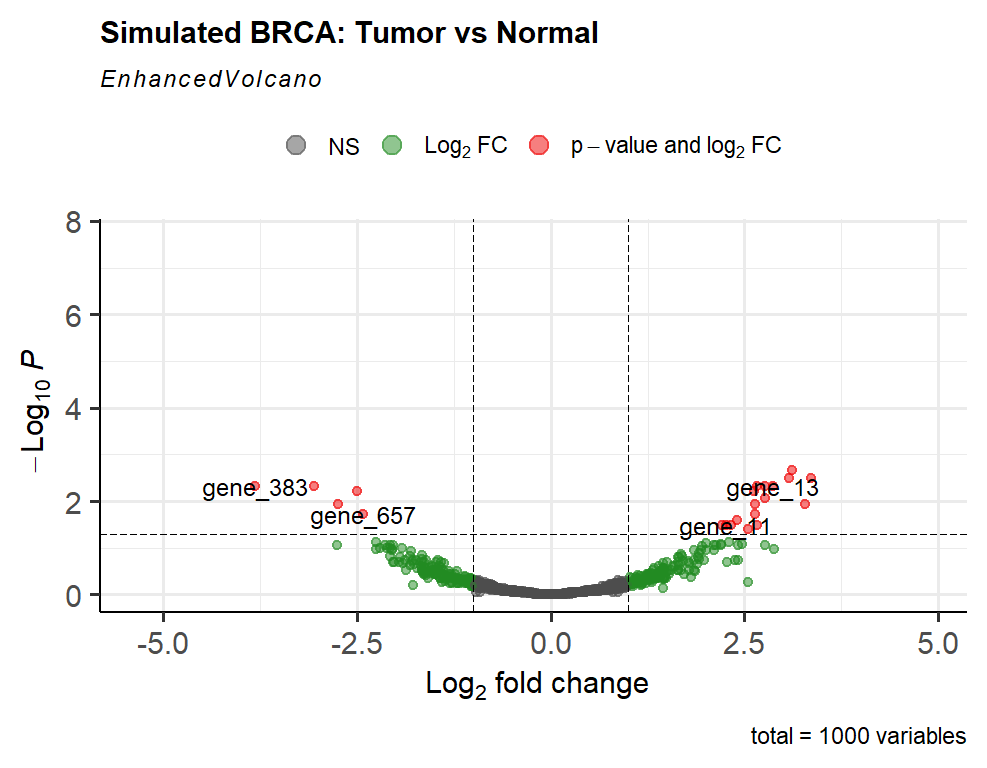
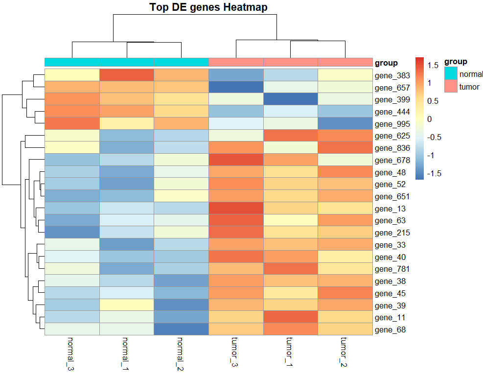
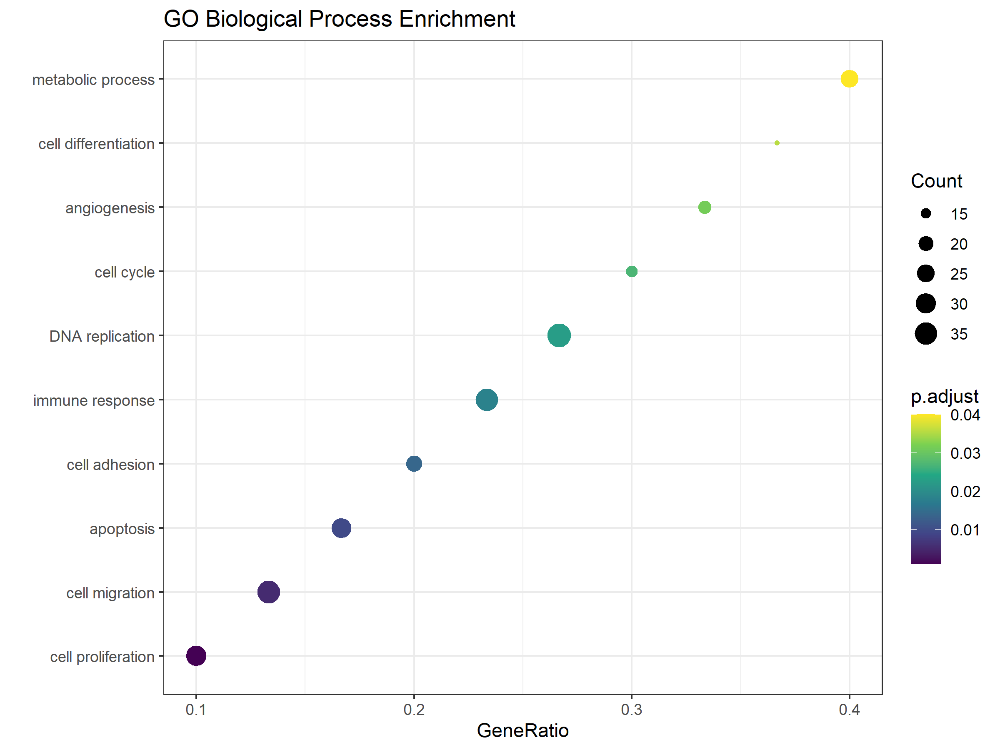
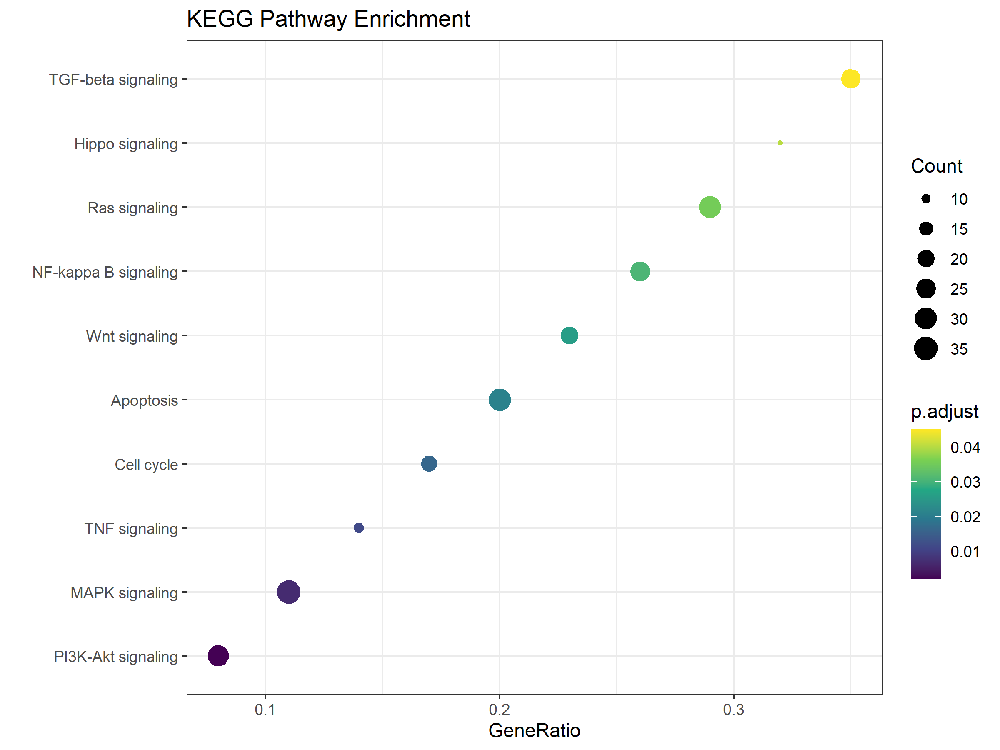

# brca-rnaseq
R code for simulated BRCA RNA-seq differential expression analysis with DESeq2, volcano plot and heatmap
# BRCA RNA-seq DESeq2 Differential Expression Analysis

This repository stores R code for simulated breast cancer RNA-seq differential expression analysis.

## Project workflow
1. Simulate gene count matrix for tumor and normal samples
2. Use DESeq2 to perform differential expression analysis
3. Identify differentially expressed genes (DEG)
4. Visualization: Volcano plot + Heatmap

## Required R packages
- DESeq2
- dplyr
- ggplot2
- pheatmap
- EnhancedVolcano

## Run instructions
Run this script in RStudio.
It will generate simulated RNA-seq count data, run DE analysis and produce volcano plot and heatmap.

## DEG threshold
- Adjusted p-value (padj) < 0.05
- |log2FoldChange| > 1
## Results
### Volcano Plot

### Heatmap

# TCGA-BRCA 转录组模拟差异分析项目
本项目使用R语言DESeq2完成肿瘤/正常样本差异基因分析，包含差异基因筛选、可视化、富集分析。

## 结果展示
### 火山图

### 热图

### GO富集气泡图

### KEGG富集气泡图

## 分析流程
1. 模拟转录组count矩阵
2. DESeq2差异表达分析
3. 筛选差异基因
4. 差异基因可视化（火山图、热图）
5. GO/KEGG富集可视化

## 运行环境
R 4.6.1，RStudio
依赖包：DESeq2, dplyr, ggplot2, pheatmap, EnhancedVolcano

